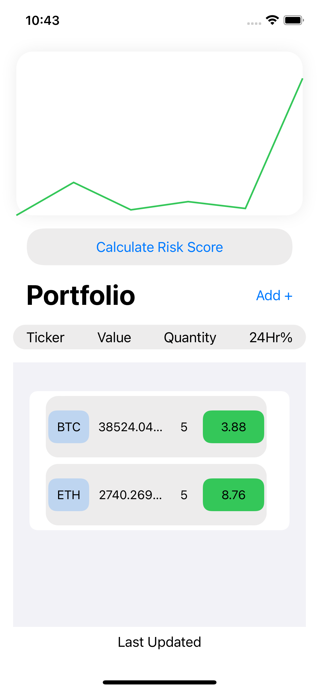
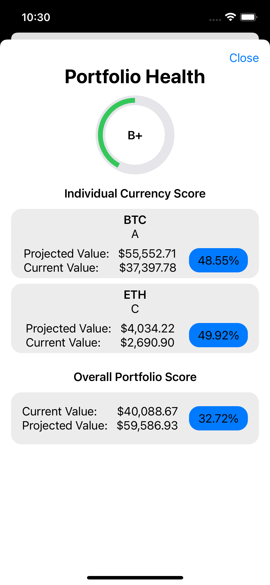
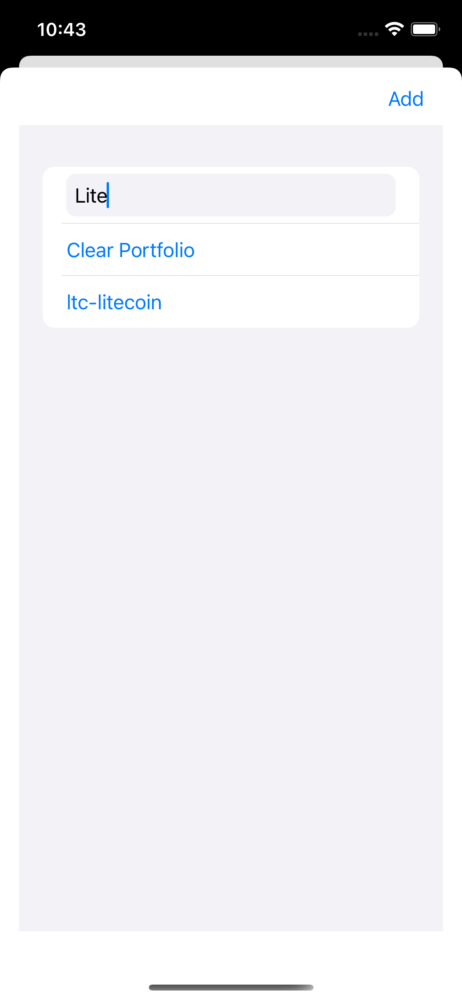

# Crypto-Analysis

### ​Welcome!
​
I recently developed the Crypto Analysis iOS App which allows users to score their own Cryptocurrency portfolio based on their coin selection and their respective quantities using historical data. 

The purpose of this App is to apply the data science skills I have gained in the past two years into a project that I believe is more relevant today than ever before. In the world of investing, investors have always been able to objectively determine how their portfolios are performing as well as predict how certain indexes or ETFs will perform in the future. Similarly, with Cryptocurrencies, I aimed to create an application that aggregates past cryptocurrency data trends and models them using certain algorithms to predict their performance within a week. Using these predictions, the application calculates a performance score that scales according to the quantity of each coin. Therefore, users can see how good their investments are based on the score they receive!

## Current Features Include:
- Display of all user selected current cryptocurrency prices in list form
- Display of percent change in price per 24hr for each cryptocurrency
- Adding a new cryptocurrency by selecting the "+" icon and searching using text
- Selecting the quantity of each selected coin
- Calculating portfolio score by selecting the "Calculate Score" option on the main screen
- Scraping all cryptocurrency data using a Python script to retrieve coin information such as lowest price, highest price, open price, closing price and volume for each day
- Graph chart to display current value of portfolio in comparison to the week prior
- Algorithm analysis using several regression models and scaling factors to determine an optimal future projection for each coin based on their historical trends, percentage change, volume change, and opening price. ​

## Gallery

 

